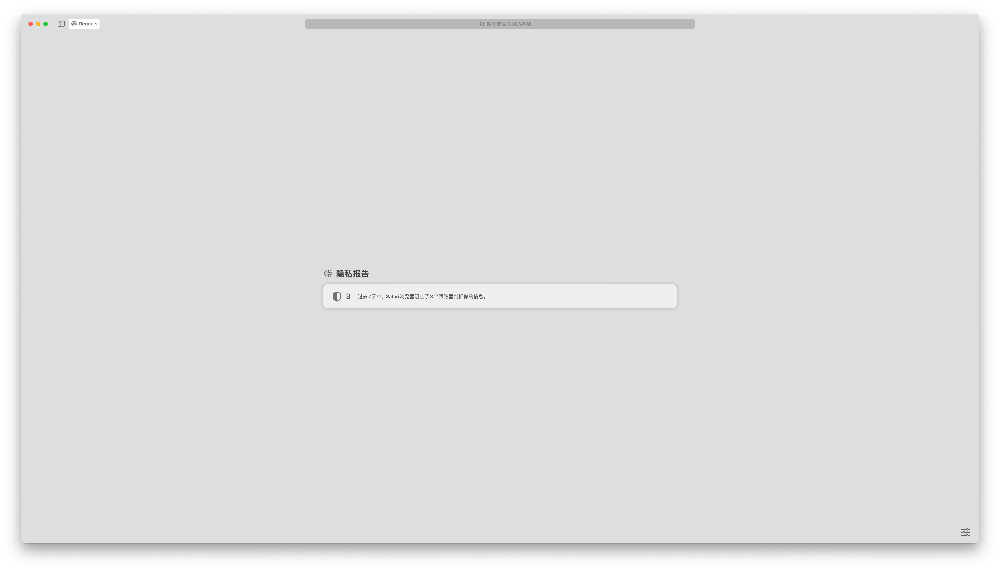
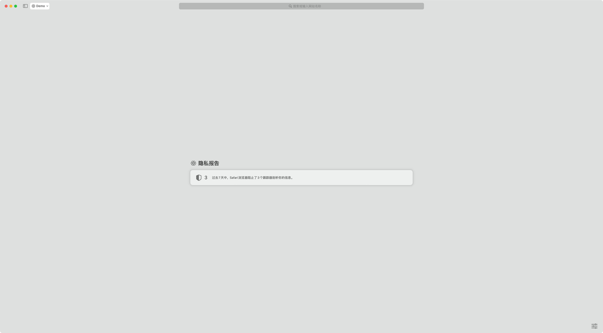

在使用 macOS 自带的截图 app 进行窗口截图的时候，默认是会附带一圈阴影的，效果如下 [^1]：

[^1]: 当博客处于浅色模式时阴影的效果才会比较明显。博客跟随系统的暗黑模式设置。

如果在不想要这圈阴影，需要在点按窗口的时候按住 <kbd>Option</kbd> 键，效果如下：

这个技巧是我查看 [官方文档](https://support.apple.com/zh-cn/102646) 时发现的，不得不说这个 feature 藏的是真深，看来 macOS 的 <kbd>Option</kbd> 键还有许多用途待探索。
