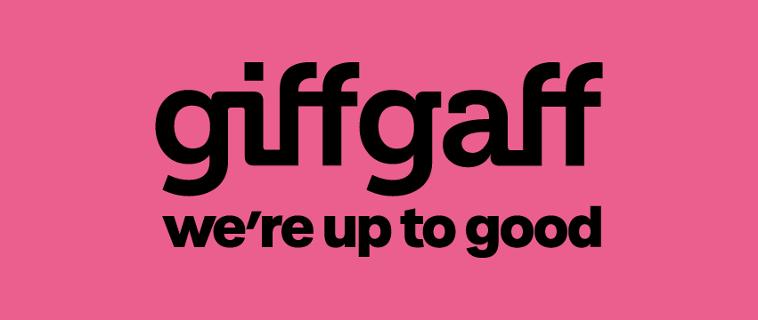
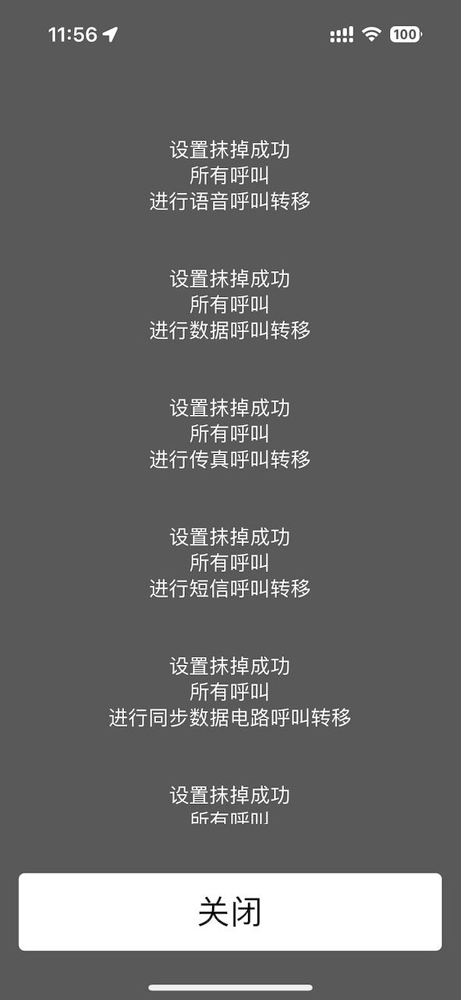
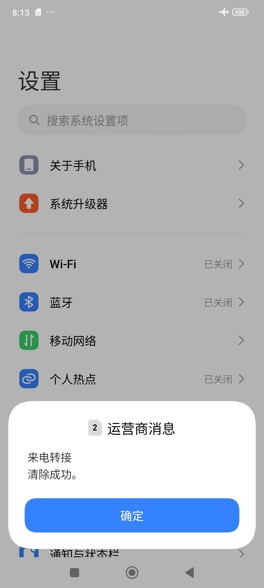
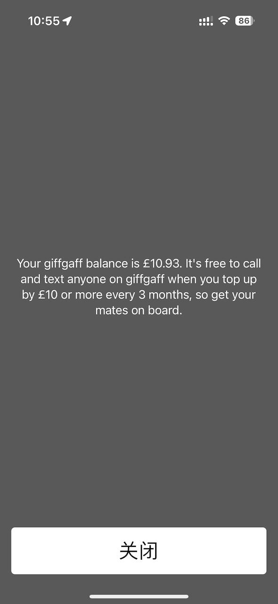

giffgaff 是一家总部位于英国的移动虚拟网络运营商（MVNO），它使用英国 O2 公司的网络提供服务，成立于 2009 年。giffgaff 的名字源于苏格兰语，意为“互惠互利”。

giffgaff 提供实体 SIM 卡与 eSIM 服务。

## 特点

- 支持全球漫游，网络使用的是英国原生 IP。在中国可以通过中国移动或中国联通进行漫游，支持 2G、3G、4G 和 5G 网络。
- 无需实名。
- 提供 0 月租套餐。
- 大陆绝大部分地区可以直连访问 [官方网站](https://www.giffgaff.com/)，可线上自助激活、充值、换卡，免费换号、eSIM 与实体卡互转等服务。
- 非虚拟号码。

## 用途

因人而异，大多数人用于注册国际服务。

## 资费

giffgaff 的套餐仅能够在英国本土使用，无法在英国境外使用。giffgaff 提供 Pay as you go 无月租选项。

在英国境外使用 giffgaff 属于漫游，各个地区的漫游资费都不同，可以通过 [Roaming with giffgaff](https://www.giffgaff.com/roaming-charges) 查询。

giffgaff 没有提供针对中国的漫游套餐。下面的表格为 2024 年 5 月 29 日的中国地区漫游资费快照：

| 项目                     | 资费       |
| ---------------------- | -------- |
| 数据                     | 20p 每 MB |
| 通话和语音邮件（前 30 秒后按秒递增收费） | £1 每分钟   |
| 接听电话（按分钟收费）            | £1 每分钟   |
| 发送短信                   | 30p 每条   |
| 接收短信                   | 免费       |
| 向英国/欧盟手机发送图片信息（彩信）     | 30p 每条   |
| 向任何其他手机发送图片信息（彩信）      | 24p 每条   |

其中 £ 为英镑，p 为便士（penny），£1 等于 100p。

## 获取途径

虽然 giffgaff 卡是一张免费的 SIM 卡，可以免费在官方申请，但是丢件概率极高，如果不丢件，也需要很久才能寄到，所以建议在淘宝等平台或者其它渠道进行购买。

## 激活



在开始激活之前，建议仔细阅读一遍 [注意事项](#注意事项) 部分，事先了解激活后需要执行的操作，以免造成不必要的损失。



### 前提

激活过程中需要充值话费，充值需要用到 MasterCard 或 VISA 的信用卡，如果没有，可以在淘宝等平台购买 giffgaff 充值券。

### 创建账号

https://www.giffgaff.com/auth/register

### 通过网页激活

https://bx7h0mz5l4n.feishu.cn/wiki/WnM2wvDoMiBqwmkR7rKc0YbQnwE

通常插卡后 1 到 15 分钟才会有信号。

## 注意事项

此部分内容建议仔细浏览，以免造成不必要的损失。

### 保号



如果 SIM 卡在过去 6 个月内未被使用，则会被停用，giffgaff 会回收电话号码，详见文档 [Why is my phone number deactivated?](https://www.giffgaff.com/help/articles/why-is-my-phone-number-deactivated)



在国内，想要保持 SIM 卡活跃，最低成本的操作方式就是**每 6 个月内发送一条短信**，发送对象是国内外手机号码均可以。如果不知道发送给谁，可以发送给 `+44 797 300 0186`，这是 [CMLink](https://www.cmlink.com/id/) 的客服电话，发送格式为 `0044 7973000186`。



发送短信及呼出电话格式为 `区号 电话号码`。如，发送给中国大陆手机号码的格式为 `0086 1xxxxxxxxxx`，发送给英国号码的格式为 `0044 7xxxxxxxxx`。



充值话费也是让 SIM 卡保持活跃的操作方式之一。文档中的 Airtime Credit 是指充值话费。

每次操作后，保号周期重新开始计算。giffgaff 会在保号周期结束前第 35 天和第 5 天各发送一封提醒邮件，建议在收到第二封提醒邮件前（如第 170 天）进行操作，这样就算操作没能成功，还会有一封邮件进行提醒。



有些用户在官网、App、短信中看到有 3 个月到期的提醒文字，此处指的是免费 giffgaff 通话和短信服务，和保号无关。详情见 [相关问题](#免费-giffgaff-通话和短信服务是什么到期了会有什么影响是否影响保号)。



### 意外扣费

这些事项可能会造成话费不必要的流失，建议所有用户都对其进行处理。

#### 网络

因为 giffgaff 的数据漫游非常昂贵（详情见 [资费](#资费) 部分），为了防止不小心使用了 giffgaff 的网络造成扣费，建议关闭 giffgaff 卡的网络功能或（和）数据漫游功能。

#### 来电转移

由于 giffgaff 默认开通了语音信箱功能，如果用户主动挂断来电，giffgaff 就会自动将通话转移到语音信箱，造成扣费。为了避免这种情况，在卡片激活完成后，需要手动关闭来电转移功能，在拨号界面输入 `##002#`，并按下拨号键，看到以下画面，表示关闭成功。有时候会操作失败，可以换个时间再尝试即可。

iOS：

Android：

### 额外注意事项

符合相应的条件才需要关注的点。

#### 苹果手机用户

苹果手机用户插卡开机后，建议不要点击接受开通 iMessage / Facetime 功能，如果接受开通的话，系统会给服务器发送一条短信，造成 £0.3 的扣费。

#### 小米手机用户

小米手机用户插卡前，请先到系统设置里搜索“免费网络短信”功能并关闭，否则插卡后，系统有可能会发一条短信给服务器，造成 £0.3 的扣费。

## 常用操作

### 查询手机号码（免费）

编辑短信内容 `number` 到 `43430` 或者 `2020`，稍等片刻后，会收到运营商发来的包含手机号码的短信。

此方法也可用于验证短信功能是否正常，如果收不到运营商的回信，可参考相关问题：[为什么发不出短信或打不出电话？](#为什么发不出短信或打不出电话)

### 查询话费余额（免费）

拨号界面输入 `*100#`，按下拨号键，稍等片刻后，屏幕上会显示话费余额，如下图：

### 查看充值记录

https://www.giffgaff.com/profile/payment-details

### 查看通话记录与账单

https://www.giffgaff.com/profile/usage-statement

## 不常用操作

### 换号

https://bx7h0mz5l4n.feishu.cn/wiki/BQNfwBqoliiDJikHM5nccWILn3b

### 换卡

https://bx7h0mz5l4n.feishu.cn/wiki/JvoTw6i0WiUj1NkRcjTcS4yInfP

### 在实体卡与 eSIM 之间进行转换

还没有支持 eSIM 的设备，等以后有了再填坑😅。有需求的可以查看 [这篇教程](https://bx7h0mz5l4n.feishu.cn/wiki/Lqa9wFUG2i29WAkEQKIcSqMEnyd) 和 [相关问题](#实体卡转为-esim-后还能继续使用吗)。

## 常见问题

### 能否挑选号码？

号码是在首次充值话费后，由系统随机分配的，后续可以在官网申请重新随机号码 2 次。

### 为什么无法上网？

如果需要上网，需要打开 giffgaff 卡的网络功能和数据漫游功能。



giffgaff 的数据漫游非常昂贵（详情见 [资费](#资费) 部分），请在不需要使用网络时及时关闭网络相关设置。



### 为什么发不出短信或打不出电话？

可能是当地运营商对境内漫游手机号码做了一定的限制，可以尝试修改手机设置 > 移动网络 > 选中你的 giffgaff 卡 > 运营商，把自动选择关闭，改为中国移动，重启设备之后应该就能发出短信或打出电话了。

相关问题：[为什么国内手机号收不到 giffgaff 发出的短信？](#为什么国内手机号收不到-giffgaff-发出的短信)

### 为什么国内手机号收不到 giffgaff 发出的短信？

国内三大运营商中，中国移动的手机号几乎收不到 giffgaff 发送的短信，中国联通和中国电信的手机号目前还是能够接收到的。

相关问题：[为什么发不出短信或打不出电话？](#为什么发不出短信或打不出电话)

### 注册各类 App 账号时提示手机号码不正确?

国际区号选择 UK（英国）或 +44，去掉国内区号 0，输入 7 开头的 10 位数字号码即可，如 `7973000186`。

### 免费 giffgaff 通话和短信服务是什么？到期了会有什么影响？是否影响保号？

首先回答最后一个问题，不会影响保号。

免费 giffgaff 通话和短信服务为用户每次充值后的福利，该服务仅作用于身处英国的 giffgaff 用户之间。不在英国的用户无需关心此服务，到期了也不会有任何影响。

### 实体卡转为 eSIM 后还能继续使用吗?

不能。一旦转移成功，实体卡很快就会丢失信号，直接按照废卡处理即可。

## 最后

本文为我根据自己的场景整理出的 giffgaff 指南，可以覆盖到大部分用户。

本文的部分内容基于 [giffgaff 中国玩家指南](https://bx7h0mz5l4n.feishu.cn/wiki/EUrzwYL6liPT35kfiSOcubAmnDh) 整理，在此感谢文档的维护者，也欢迎加入其 [telegram 群组](https://t.me/Giffgaff_China) 进行讨论。

<!--
- [新玩意 178｜少数派的编辑们最近买了啥？ - 少数派](https://sspai.com/post/88142) - 5ber 实体 eSIM 卡
- [eSIM 转 SIM 实体卡 | 回声](https://iecho.cc/2023/10/20/Convert-eSIM-to-physical-SIM/)
- [2024年英国的0月租GiffGaff卡申请与激活使用 | Polaris的小站](https://www.lpolaris.com/article/giffgaff)
- [giffgaff保姆级使用教程2024](https://giffgaffsim.notion.site/giffgaff-2024-e62d10bf0e944a129bc31c5b0d240f8d)
- [Giffgaff eSIM 上车指南 | MyKeyVans’ Notion](https://notion.mykeyvans.space/article/giffgaff-esim)
--!>
