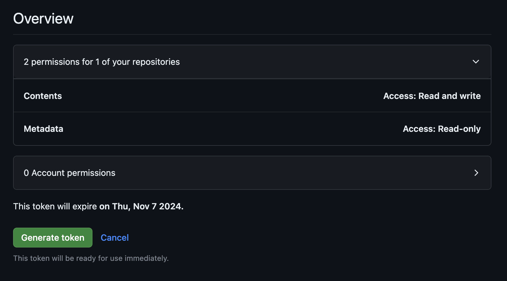
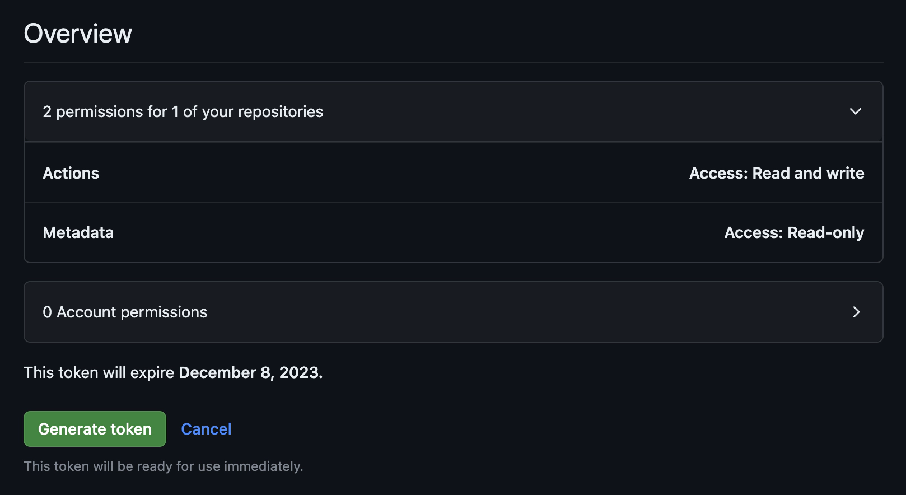
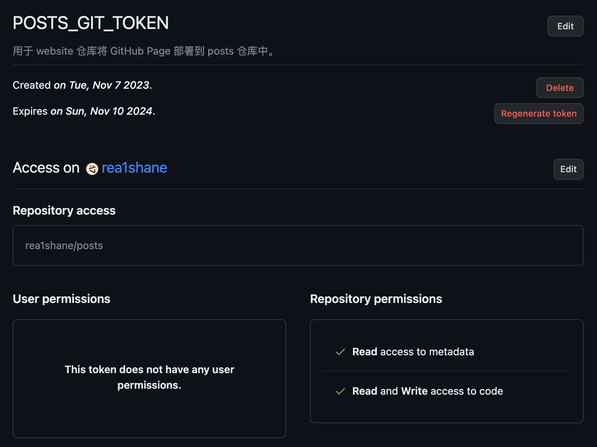
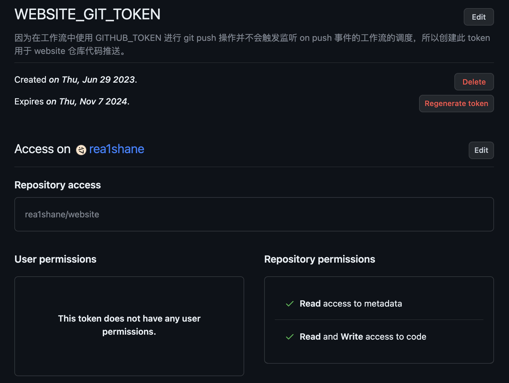
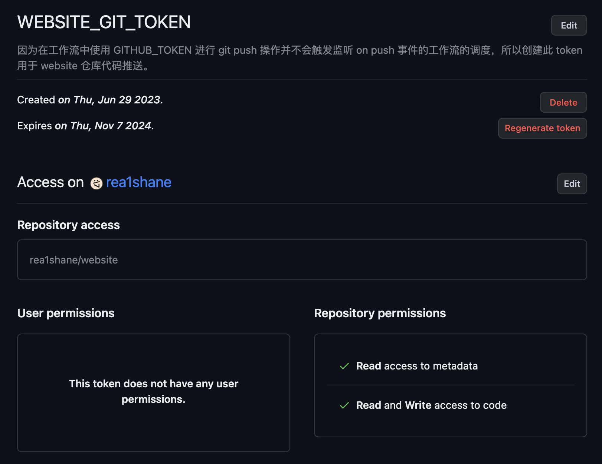

我的博客是通过 [Hugo](https://gohugo.io/) 生成的，并部署在了 [GitHub Pages](https://pages.github.com/) 上。与官方教程不一样的是，我把完整的博客项目拆分成了两个仓库，分别管理博客的框架与内容，实现了两部分的解耦。但是这样就需要两个仓库合起来才能构建出一个完整的博客，这篇文章就来分享一下我是如何在这个场景下完成博客的 <abbr title="Continuous Integration and Continuous Delivery">CI/CD</abbr> 的。

在进入正题之前，先来介绍一下两个仓库的内容。标准 Hugo 博客项目的基础结构如下：

```
blog/
├── assets/
├── content/
│   └── posts/ # 博文内容
├── layouts/
├── static/
├── themes/
└── hugo.yaml
```

其中 `content/posts` 目录用于存放博文，其他的文件则负责博客的样式，所以我将 `posts` 部分抽取出来作为博文仓库，其余的内容作为博客框架仓库（以下简称框架仓库），然后通过 Git 的 [submodule](https://git-scm.com/book/zh/v2/Git-%E5%B7%A5%E5%85%B7-%E5%AD%90%E6%A8%A1%E5%9D%97) 功能将博文仓库作为作为框架仓库的一个子模块：

```shell
git submodule add --depth=1 https://github.com/rea1shane/posts.git content/posts
```

这样两个仓库合二为一的同时也保持了相互独立。

## 将博客部署到 GitHub Pages

因为所有内容都托管在了 GItHub 上，所以我顺理成章地选用 [GItHub Actions](https://github.com/features/actions) 作为 CI/CD 工具。如果 Hugo 博客项目的所有内容存放在同一个仓库下的话，只需按照 Action [`peaceiris/actions-hugo`](https://github.com/marketplace/actions/hugo-setup) 的 [Getting started](https://github.com/marketplace/actions/hugo-setup#getting-started) 部分去做即可完成 GItHub Page 的部署。教程中使用的工作流 YAML 如下：

```yaml
name: GitHub Pages

on:
  push:
    branches:
      - main  # Set a branch to deploy
  pull_request:

jobs:
  deploy:
    runs-on: ubuntu-22.04
    concurrency:
      group: ${{ github.workflow }}-${{ github.ref }}
    steps:
      - uses: actions/checkout@v4
        with:
          submodules: true  # Fetch Hugo themes (true OR recursive)
          fetch-depth: 0    # Fetch all history for .GitInfo and .Lastmod

      - name: Setup Hugo
        uses: peaceiris/actions-hugo@v2
        with:
          hugo-version: '0.119.0'
          # extended: true

      - name: Build
        run: hugo --minify

      - name: Deploy
        uses: peaceiris/actions-gh-pages@v3
        if: github.ref == 'refs/heads/main'
        with:
          github_token: ${{ secrets.GITHUB_TOKEN }}
          publish_dir: ./public
```

这个工作流对 Hugo 项目进行构建，并将产生的静态网站代码部署在了当前仓库的 GItHub Page 上。

因为我的项目被拆分成了两个仓库，所以我可以选择将静态网站代码部署在其中任意一个仓库的 GitHub Page 上，但是因为我私有化了框架仓库，GitHub Pages 又不允许免费用户在私有仓库上部署网站，所以我只能选择将博客部署在博文仓库上。但是负责构建博客的工作流需要运行在框架仓库上，想要将构建后的内容部署在非本仓库，需要对工作流进行一点小小的改动。

负责部署的 Action 是 [`peaceiris/actions-gh-pages`](https://github.com/marketplace/actions/github-pages-action)，它的 [`external_repository`](https://github.com/marketplace/actions/github-pages-action#%EF%B8%8F-deploy-to-external-repository-external_repository) 参数支持将内容部署在非运行该工作流的仓库上：

```yaml
- name: Deploy
  uses: peaceiris/actions-gh-pages@v3
  with:
    deploy_key: ${{ secrets.ACTIONS_DEPLOY_KEY }}
    external_repository: username/external-repository
    publish_branch: your-branch
    publish_dir: ./public
```

这一操作需要目标仓库的写入权限，原先工作流中使用的 token 是 `GITHUB_TOKEN`，它随附于仓库并且只拥有本仓库的权限，所以这里不能使用该 token 来进行操作，还需要准备一个具有所需权限的 token。

### 创建用于部署代码的 PAT

GItHub 支持创建 [PAT](https://docs.github.com/en/authentication/keeping-your-account-and-data-secure/managing-your-personal-access-tokens) 来为一些需要认证的操作授权。在上文的场景中，框架仓库需要一个 PAT 来帮助它获得博文仓库的写入权限。

要到 PAT 的管理页面 [^1]，可以直接访问链接 https://github.com/settings/tokens?type=beta 或按照以下步骤：

[^1]: 这里选用较为灵活的 Fine-grained personal access tokens。

1. 进入 GitHub 网页。
1. 点击右上角的头像。
1. 点击 **Settings**。
1. 点击左侧栏最下方的 **Developer settings**。
1. 展开 **Personal access tokens**，点击 **Fine-grained tokens**。

点击 **Generate new token** 按钮创建一个新的 PAT，需要进行的设置如下：

- **Token name**：为 token 起一个名字。
- **Expiration**：Token 的过期时间。最长设置为一年 [^2]。Token 过期后可以通过其详情页中的 **Regenerate token** 按钮重新生成 [^3]。
- **Description**：描述这个 token 的作用。
- **Resource owner**：选择这个 token 是使用哪个用户创建的，选项中还会包含你所在的组织。因为博客仓库是管理在自己账号下的，所以选自己即可。
- **Repository access**：选择仓库的可访问性。这里建议权限最小化原则，因为是要将博客代码部署到博文仓库中，所以选择 **Only select repositories** 选项，然后只添加博文仓库即可。

[^2]: 需要在下拉框中选中 **Custom** 选项，然后选择日期。
[^3]: 当然，token 没有过期的时候也可以重新生成。

接下来还需要设置 token 所具有的权限，因为部署 GitHub Page 实际上是向仓库的分支提交网页代码，所以需要拥有对仓库代码的写权限。展开 **Permissions** 中的 **Repository permissions**，将 **Contents** 部分的权限修改为 **Read and write**。进行完该设置后，**Metadata** 部分会被强制设置为 **Read-only** 的访问权限，并带有 mandatory 提示。

在提交之前，可以在按钮的上方看到所有设置的概览，它应当与这个类似：



确认提交之后，页面上会显示 PAT 的值以及其详细信息，保存 PAT 的值以供后续步骤使用。


你**有且仅有一次机会复制 token 的内容**！刷新页面后就没有机会再找回 PAT 的值了。如果你因为各种原因丢失了 PAT 的值，可以通过 **Regenerate token** 按钮再生成一次。


### 将 PAT 添加到框架仓库的 secrets 中

在创建完 PAT 后，还需将其添加到框架仓库的 secrets 中，这样仓库中的工作流才可以安全地使用该 token，进而拥有 token 对应的权限。

可以通过访问 https://github.com/user_name/repository_name/settings/secrets/actions [^4] 或按照以下步骤进入框架仓库的 secrets 管理页面：

[^4]: 将链接中的 `user_name` 和 `repository_name` 替换为你的用户名和你框架仓库的仓库名。

1. 进入框架仓库的 GitHub 页面。
1. 点击 **Settings** 标签卡。
1. 展开左侧栏中的 **Secrets and variables**，点击 **Actions**。

然后按照以下步骤创建一个 secret：

1. 点击 **New repository secret** 按钮。
1. 在 **Name** 中输入一个名称 [^5]。
1. 在 **Secret** 中输入刚刚创建的 PAT 的值。
1. 点击 **Add secret** 按钮完成创建。

[^5]: 推荐 secret 和 PAT 名称保持一致，便于记忆。

### 修改部署 Action

在创建完 secret 后，需要对部署 Action 进行一些配置让其使用该 secret：

- 将 `github_token` 更换为 `personal_token` 以使用 PAT 类型的认证，并以 `${{ secrets.SECRET_NAME }}` 的形式来引用 secret。
- 设置 `external_repository` 指定外部仓库。

这是一个我的例子：

```diff
  - name: Deploy
    uses: peaceiris/actions-gh-pages@v3
    if: github.ref == 'refs/heads/main'
    with:
-     github_token: ${{ secrets.GITHUB_TOKEN }}
+     personal_token: ${{ secrets.GH_PAGES_TOKEN }}
+     external_repository: rea1shane/posts
      publish_dir: ./public
```

在所有内容都正确的设置后，尝试向框架仓库 push 一些内容，发现博客静态网站代码被推送到了博文仓库的 `gh-pages` 分支 [^6]，这就说明博客的部署已经大功告成了。

[^6]: 如果没有进行额外配置，`peaceiris/actions-gh-pages` 会将代码部署在 `gh-pages` 分支。如果你需要的话，可以按照 [文档](https://github.com/marketplace/actions/github-pages-action#%EF%B8%8F-set-another-github-pages-branch-publish_branch) 进行自定义配置。

## 更多的自动化

在搭建好博客后，一般只会修改博文仓库，并且希望在更新完博文仓库后博客可以自动的更新部署。但是现在存在一个问题：博文仓库和框架仓库是通过 submodule 联系在一起的，框架仓库没有办法自动感知到博文仓库的更新，博客的 CI/CD 又是由框架仓库的内容变更触发的，这就导致在更新完博文仓库后博客不会有任何变化。所以接下来还需要再做一些事情，让整个流程更加的通畅。

### 自动更新框架仓库中的博文内容

博文仓库在框架仓库的引用的自动的更新肯定是最重要的一步，这就需要一个工作流来完成这个事情。因为一个仓库没有办法感知到另一个仓库的变化，所以工作流的触发方式中没有监听其他仓库的事件类型。但是有一种监听事件 [`workflow_dispatch`](https://docs.github.com/en/actions/using-workflows/events-that-trigger-workflows#workflow_dispatch) 相对比较合适，它可以被 [GitHub API](https://docs.github.com/en/rest?apiVersion=2022-11-28)、[GitHub CLI](https://cli.github.com/) 或 GitHub web 界面点击按钮触发工作流的调度，可以在框架仓库创建一个更新 submodule 的工作流，然后让博文仓库在自身发生变更后主动触发它。

框架仓库更新 submodule 的工作流 YAML 如下：

```yaml
name: Update posts

on:
  workflow_dispatch:

jobs:
  update:
    runs-on: ubuntu-latest
    steps:
      - name: Checkout website
        uses: actions/checkout@v4

      - name: Checkout posts
        uses: actions/checkout@v4
        with:
          repository: rea1shane/posts
          path: content/posts

      - name: Commit
        run: |
          git config --local user.name "github-actions[bot]"
          git config --local user.email "github-actions[bot]@users.noreply.github.com"
          git commit -am "Auto updated posts" || echo "No changes to commit"

      - name: Push
        uses: ad-m/github-push-action@master
        with:
          branch: ${{ github.ref }}
```

这个工作流会更新 posts 这个 submodule，并且使用 `github-actions[bot]` 这个机器人推送到触发工作流的分支。

现在就需要在博文仓库内容更新后，触发框架仓库的这个工作流。在这个场景下，使用 GitHub API 来 [创建工作流调度事件](https://docs.github.com/en/free-pro-team@latest/rest/actions/workflows?apiVersion=2022-11-28#create-a-workflow-dispatch-event) 是一种比较适合的做法，其模板命令如下：

```shell
curl -L \
  -X POST \
  -H "Accept: application/vnd.github+json" \
  -H "Authorization: Bearer TOKEN" \
  -H "X-GitHub-Api-Version: 2022-11-28" \
  https://api.github.com/repos/OWNER/REPO/actions/workflows/WORKFLOW_ID/dispatches \
  -d '{"ref":"BRANCH","inputs":{"name":"Mona the Octocat","home":"San Francisco, CA"}}'
```

这段命令需要以下信息：

- `TOKEN`：因为工作流不是任何人都可以调度的，所以需要一个 token 进行权限的验证。
- `OWNER/REPO`：被触发工作流所位于的仓库。
- `BRANCH`：被触发工作流所在的分支名称。因为 `workflow_dispatch` 事件只能在仓库默认分支被触发，所以填写默认分支名称即可。
- `WORKFLOW_ID`：被触发工作流的 ID。可以将其设置为工作流文件名。例如，我将其设置为 `update-posts.yaml`。

`TOKEN` 部分可以参考 [创建用于部署代码的 PAT](#创建用于部署代码的-pat) 部分创建一个 PAT。核心设置的差异为：

1. 这个 PAT 用于触发框架仓库的工作流，所以 **Repository access** 部分还是选择 **Only select repositories**，添加框架仓库即可。
1. **Permissions** 部分同样修改的是 **Repository permissions**，将 **Actions** 部分的权限修改为 **Read and write**。进行完该设置后，**Metadata** 部分也会被强制设置为 **Read-only** 的访问权限，并且也会带有 mandatory 提示。

提交按钮上方的概览应当与这个类似：



创建完 PAT 后，需要将其添加到博文仓库的 secrets 中。

现在需要将这个 API 包装为一个工作流，将其存放在博文仓库，这个工作流在博文仓库内容变更后触发，继而触发框架仓库的同步博文工作流。工作流 YAML 如下：

```yaml
name: Notify Website

on:
  push:
    branches:
      - main

jobs:
  notify:
    name: Notify Website
    runs-on: ubuntu-latest

    steps:
      - name: Github REST API Call
        env:
          ACTIONS_TRIGGER_TOKEN: ${{ secrets.WORKFLOW_TRIGGER_TOKEN }}
          WEBSITE_REPO: rea1shane/website
          WEBSITE_BRANCH: main
          WORKFLOW_ID: update-posts.yaml
        run: |
          curl \
            -fL \
            --retry 3 \
            -X POST \
            -H "Accept: application/vnd.github+json" \
            -H "Authorization: token ${{ env.ACTIONS_TRIGGER_TOKEN }}" \
            https://api.github.com/repos/${{ env.WEBSITE_REPO }}/actions/workflows/${{ env.WORKFLOW_ID }}/dispatches \
            -d '{"ref":"${{ env.WEBSITE_BRANCH }}"}'
```

### 让 Action 中的 push 操作触发监听 push 事件的工作流

接下来又发现一个问题：更新博文工作流将代码 push 到仓库后，监听 push 操作的部署 GItHub Page 工作流却没有动静。在查找相关资料后，发现这是 GItHub Actions 的一个 feature，在 GItHub Community 的 Discussion [Push from Action does not trigger subsequent action](https://github.com/orgs/community/discussions/25702) 中有进行解释：

> If an action pushes code using the repository’s GITHUB_TOKEN, a new workflow will not run even when the repository contains a workflow configured to run when push events occur.

意思就是使用仓库的 `GITHUB_TOKEN` 进行 push 并不能触发监听 push 事件的下游工作流的调度。这里就需要使用一个 PAT 取代 `GITHUB_TOKEN`，这个 PAT 与部署 GItHub Page 工作流使用的 PAT 只有一处差异：将 **Only select repositories** 选项中选择的仓库由博文仓库更改为框架仓库即可，然后将这个 PAT 添加到框架仓库中。

接下来需要修改更新博文工作流，使其使用刚刚创建的 PAT 进行 push 操作：

```diff
  name: Update posts

  on:
    workflow_dispatch:

  jobs:
    update:
      runs-on: ubuntu-latest
      steps:
        - name: Checkout website
          uses: actions/checkout@v4
+         with:
+           persist-credentials: false

        - name: Checkout posts
          uses: actions/checkout@v4
          with:
            repository: rea1shane/posts
            path: content/posts

        - name: Commit
          run: |
            git config --local user.name "github-actions[bot]"
            git config --local user.email "github-actions[bot]@users.noreply.github.com"
            git commit -am "Auto updated posts" || echo "No changes to commit"

        - name: Push
          uses: ad-m/github-push-action@master
          with:
+           github_token: ${{ secrets.WEBSITE_GIT_TOKEN }}
            branch: ${{ github.ref }}
```

注意这里设置了 `persist-credentials: false`，如果不设置该项的话，push 操作还会使用 `GITHUB_TOKEN` 而不是 PAT，详情可见 Action [actions/checkout](https://github.com/marketplace/actions/checkout) 或 [这个 Discussion](https://github.com/orgs/community/discussions/26220)。

这样设置以后，当更新博文工作流运行完毕后，部署博客工作流将会自动地调度起来，整个 CI/CD 流程也就完整的串了起来。

## 最后

将内容解耦并进行一些衔接，既保证了互相的独立性，又不影响整体的流程，·这就是这次实践的目的。

最后总结一下所有的操作项，如果你也想像我一样做，可以用来确认自己的操作步骤是否有误：

1. **拆分**：项目拆分为了两个仓库，分别负责框架部分与博文部分，并通过 submodule 联系到了一起。
1. **GitHub Actions**（共 3 个）：
	- **框架仓库**（2 个）：创建了两个工作流，分别负责更新博文和部署 GitHub Pages。
	- **博文仓库**（1 个）：创建了一个工作流，负责触发框架仓库的更新博文工作流。
1. **GitHub PAT**（共 3 个）：
	- **框架仓库**（2 个）：更新博文工作流使用一个 PAT 用于更新博文仓库的代码，该 PAT 具有博文仓库的读写权限；部署 GItHub Pages 工作流使用一个 PAT 用于推送代码到博文仓库的 `gh-pages` 分支，该 PAT 拥有博文仓库的读写权限。
	- **博文仓库**（1 个）：使用一个 PAT 用于触发博文仓库的工作流，该 PAT 具有博文仓库的 Actions 读写权限。

部署 GItHub Pages 工作流 YAML 文件样例如下：

```yaml
# gh-pages.yaml 位于框架仓库

name: GitHub Pages

on:
  push:
    branches:
      - main
    paths-ignore:
      - .github/workflows/update-posts.yaml

jobs:
  deploy:
    runs-on: ubuntu-22.04
    concurrency:
      group: ${{ github.workflow }}-${{ github.ref }}
    steps:
      - uses: actions/checkout@v4
        with:
          submodules: recursive

      - name: Setup Hugo
        uses: peaceiris/actions-hugo@v2
        with:
          hugo-version: latest

      - name: Build
        run: hugo --minify

      - name: Deploy
        uses: peaceiris/actions-gh-pages@v3
        if: github.ref == 'refs/heads/main'
        with:
          personal_token: ${{ secrets.POSTS_GIT_TOKEN }}
          external_repository: rea1shane/posts
          publish_dir: ./public
```

更新博文工作流 YAML 文件样例如下：

```yaml
# update-posts.yaml 位于框架仓库

name: Update posts

on:
  workflow_dispatch:

jobs:
  update:
    runs-on: ubuntu-latest
    steps:
      - name: Checkout website
        uses: actions/checkout@v4
        with:
          persist-credentials: false

      - name: Checkout posts
        uses: actions/checkout@v4
        with:
          repository: rea1shane/posts
          path: content/posts

      - name: Commit
        run: |
          git config --local user.name "github-actions[bot]"
          git config --local user.email "github-actions[bot]@users.noreply.github.com"
          git commit -am "Auto updated posts" || echo "No changes to commit"

      - name: Push
        uses: ad-m/github-push-action@master
        with:
          github_token: ${{ secrets.WEBSITE_GIT_TOKEN }}
          branch: ${{ github.ref }}
```

触发更新博文工作流的工作流 YAML 文件样例如下：

```yaml
# dispatch-website-workflow.yaml 位于博文仓库

name: Dispatch website workflow

on:
  push:
    branches:
      - main
    paths-ignore:
      - .github

jobs:
  dispatch:
    runs-on: ubuntu-latest
    steps:
      - name: Call GitHub REST API
        env:
          TOKEN: ${{ secrets.WEBSITE_GH_ACTIONS_TOKEN }}
          REPO: rea1shane/website
          REF: main
          WORKFLOW_ID: update-posts.yaml
        run: |
          curl \
            -fL \
            --retry 3 \
            -X POST \
            -H "Accept: application/vnd.github+json" \
            -H "Authorization: token ${{ env.TOKEN }}" \
            https://api.github.com/repos/${{ env.REPO }}/actions/workflows/${{ env.WORKFLOW_ID }}/dispatches \
            -d '{"ref":"${{ env.REF }}"}'
```

PAT `POSTS_GIT_TOKEN`：



PAT `WEBSITE_GIT_TOKEN`：



PAT `WEBSITE_GH_ACTIONS_TOKEN`：



## 相关链接

- [Host on GitHub Pages | Hugo](https://gohugo.io/hosting-and-deployment/hosting-on-github/)
- [Managing your personal access tokens - GitHub Docs](https://docs.github.com/en/authentication/keeping-your-account-and-data-secure/managing-your-personal-access-tokens#creating-a-fine-grained-personal-access-token)
