最开始的我只是想要一把打游戏用的机械键盘，当时对键盘的认知还停留在 Cherry、红黑茶轴等入门常见的名词上。在选购键盘的时候不经意刷到了一把 65% 配列的键盘，从未见过的小巧精致的外观刷新了我对键盘的印象。当了解到这是一个名叫 KDBfans 的工作室推出的“客制化键盘”，不经意间我就滚向了这个来易去难的大坑。

记录一下让我在坑中越跌越深的一些产品。

## 套件

键盘主体由三部分组成：套件、轴体和键帽。套件是一把键盘最主要的组成部分，决定了键盘的颜值、结构、使用感受等等。套件最少包含外壳、PCB、定位板、连接各部分用的螺丝等内容，现在的客制化套件大多还会随附键盘空腔填充物 [^1]、装饰品 [^2]、键盘连接线、键盘收纳包等物品。

[^1]: 为了解决键盘的空腔音问题，填充物俗称声音包。
[^2]: 如铭牌等装饰件。

### Navi 70

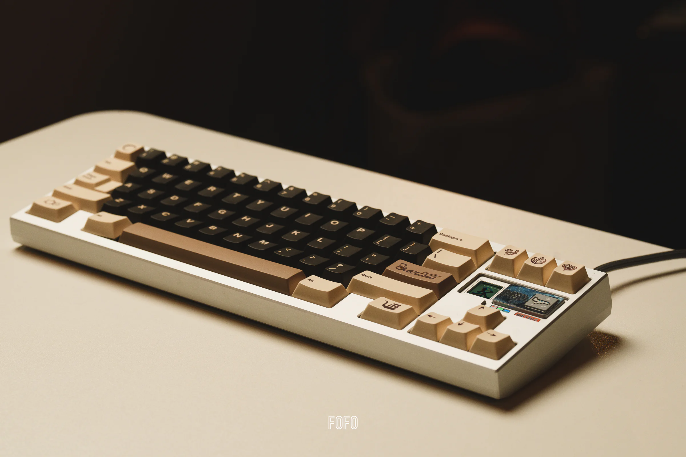

- **设计**：Matrix Lab
- **配列**：70%
- **发售时间**：2023 年 5 月 10 日
- **发售价格**：￥3500
- **购入时间**：2024 年 3 月 8 日
- **购入版本**：阳极银，小门牙
- **购入价格**：￥2650

目前心目中的最佳 70% 配列。

### Spring

- **设计**：OwLab
- **配列**：Alice
- **发售时间**：2022 年 1 月 11 日
- **发售价格**：￥2100 起
- **相关链接**：[IC](https://www.zfrontier.com/app/flow/4XLWOk7jXMKl)
- **购入时间**：2023 年 8 月 1 日
- **购入版本**：电泳奶咖
- **购入价格**：￥1450 + ￥445 + ￥65 = ￥1960 （亖条复刻外壳 + 原装内胆 + 细总定位板）

### SONIC 170

- **设计**：rien
- **配列**：70%
- **发售时间**：2023 年 6 月 28 日
- **发售价格**：￥1799 起
- **相关链接**：[GB](https://www.zfrontier.com/app/flow/wJ9bg5ZpvMXp)

### PT990

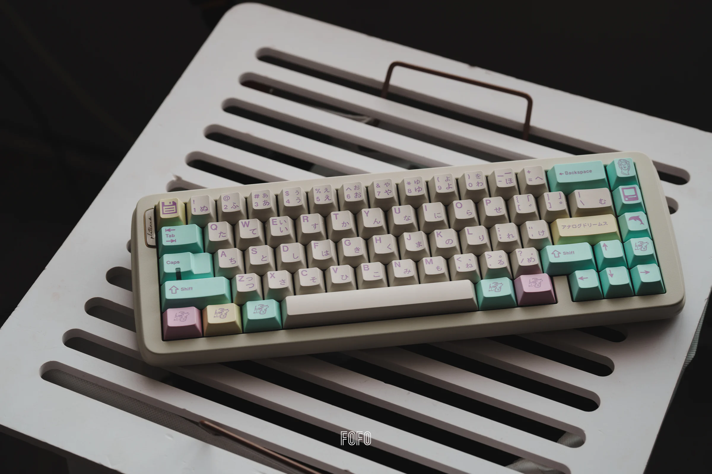

- **设计**：Percent Studio
- **配列**：65%
- **发售时间**：2022 年 10 月 7 日
- **发售价格**：￥2699 起
- **相关链接**：[IC](https://www.zfrontier.com/app/flow/pvaxm9BgkwyO)

### Space 65

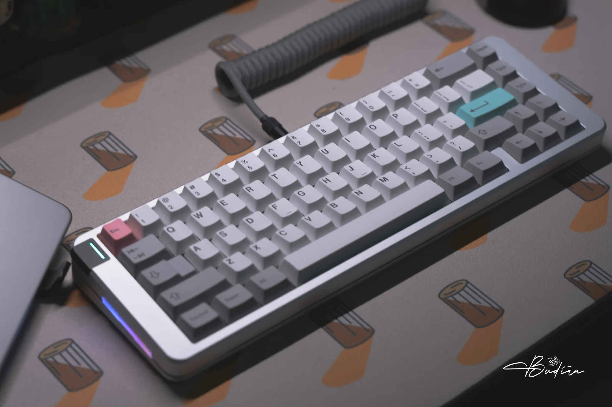

- **设计**：Gray Studio
- **版本**：R3
- **配列**：65%
- **发售时间**：2022 年 1 月 13 号
- **发售价格**：￥2299 起
- **相关链接**：[GB](https://www.zfrontier.com/app/flow/2JkkaEAxjzaM) | [组装视频](https://www.youtube.com/watch?v=XqE8re3CsGU)

### Razor 65

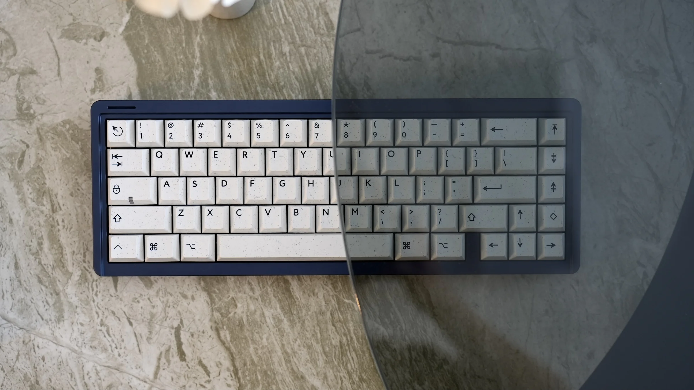

- **设计**：TWP WORKS
- **配列**：65%
- **发售时间**：2023 年 2 月 28 日
- **发售价格**：￥949 起
- **相关链接**：[GB](https://www.zfrontier.com/app/flow/xA3gZqmxjyyM)

### 8XV 3.0

- **设计**：Matrix Lab
- **配列**：80%
- **发售时间**：2022 年 1 月 17 日
- **发售价格**：￥3300 起
- **相关链接**：[GB](https://shimo.im/docs/WGK89JQCYrRvjqtk/read)

### Class 80

- **设计**：M-M Studio
- **配列**：80%
- **发售时间**：2023 年 10 月 25 日
- **发售价格**：￥1950 起
- **相关链接**：[GB](https://www.zfrontier.com/app/flow/VL9EObV1Mjzm)

### NCR 80

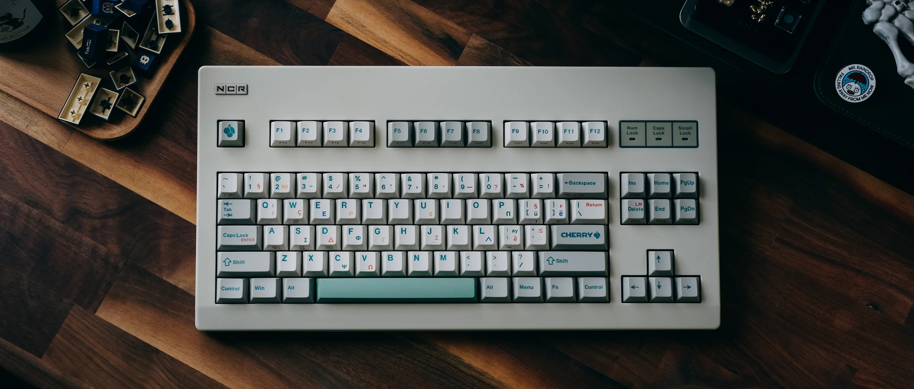

- **设计**：九九
- **配列**：80%
- **发售时间**：2021 年 4 月 6 日
- **发售价格**：￥399 起
- **相关链接**：[IC](https://www.zfrontier.com/app/flow/D7OvzYkKp7rE)
- **购入时间**：2024 年 3 月 17 日
- **购入版本**：R2，Cherry G80-3007 的浅灰，WKL
- **购入价格**：￥399

### Harpe 65

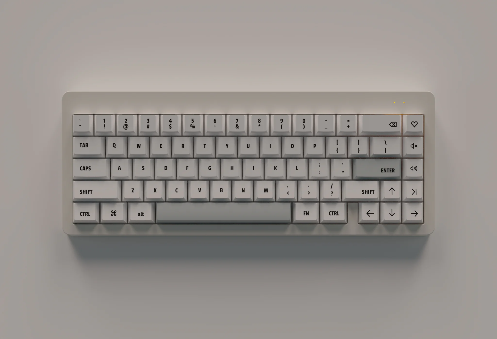

- **设计**：404
- **配列**：65%
- **发售时间**：2022 年 10 月 23 日
- **发售价格**：￥999 起
- **相关链接**：[GB](https://www.zfrontier.com/app/flow/LalzmdmQERqW)

### AQUILA

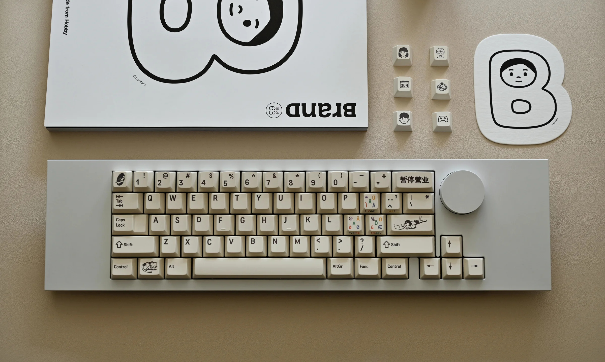

- **设计**：K 星工作室
- **配列**：65%
- **发售时间**：2022 年 8 月 2 日
- **发售价格**：￥1399 起
- **相关链接**：[GB](https://www.zfrontier.com/app/flow/enkazVPQjgyg)

### TPS 40

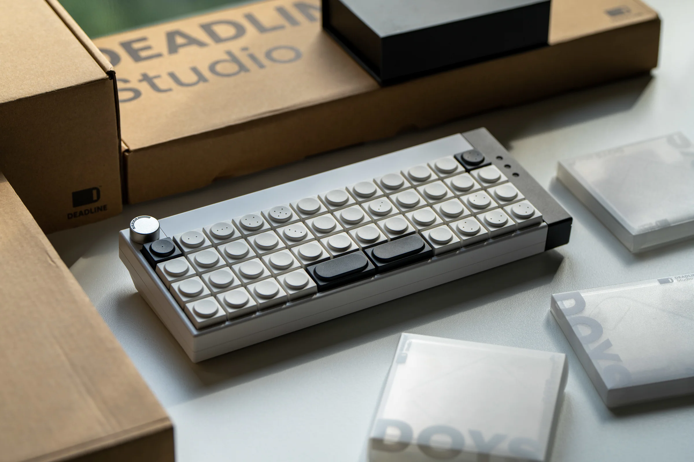

- **设计**：Openkey Design
- **配列**：40%
- **发售时间**：2023 年 3 月 18 日
- **发售价格**：￥1849 起
- **相关链接**：[IC](https://www.zfrontier.com/app/flow/7paR8OyQ7Lnn) | [GB](https://www.zfrontier.com/app/flow/mdG0VdKEQ87a)

### Phase One 65

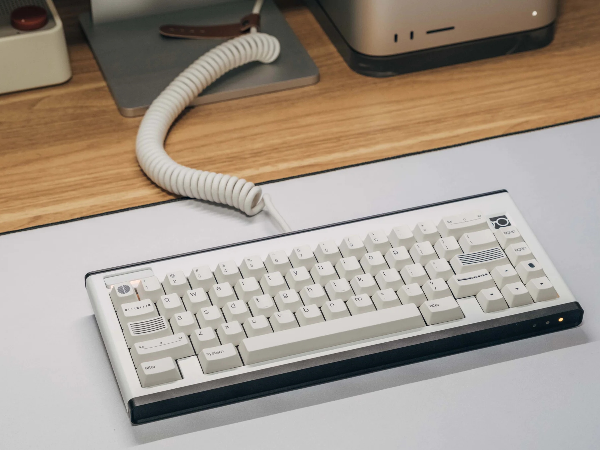

- **设计**：Openkey Design
- **配列**：65%
- **发售时间**：2021 年 9 月 24 日
- **发售价格**：￥2897 起
- **相关链接**：[GB](https://www.zfrontier.com/app/flow/2g8QlmxGvkbo)

## 键帽

### 2048

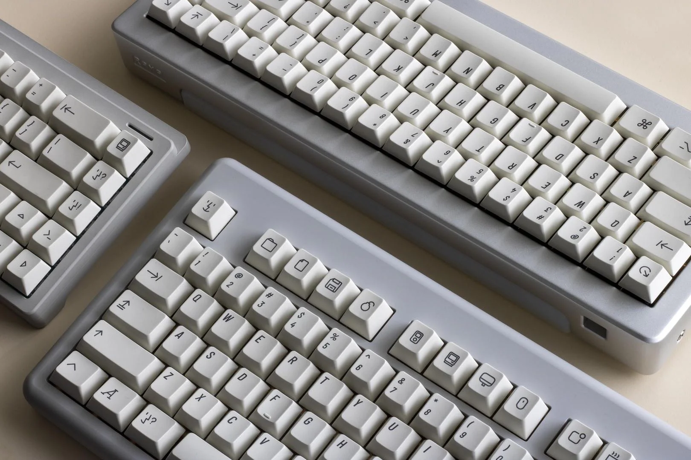

- **设计**：Biip
- **制造**：EnjoyPBT
- **高度**：Cherry 原厂高度
- **材质**：PBT
- **工艺**：热升华
- **兼容性**：Cherry MX 开关和 MX 类似风格
- **发售时间**：2019 年 4 月 19 日
- **相关链接**：[GB](https://www.keebtalk.com/t/gb-enjoypbt-extended-2048/5794)

> Heavily inspired by the [AEKII](https://deskthority.net/wiki/Apple_Extended_Keyboard_II), the main idea was to create an icon based keyset with a neo-retro look, inspired by old Apple keyboards. I wanted to have something with a minimalistic but intuitive look, which explains the icons mods!
>
> I took time to re-think the kits, get rid of the useless stuff and basically made it simpler.
>
> —— Biip

心目中最好看的一套键帽，刚入圈的时候就被这套键帽吸引，几年过去了，还是没有一套键帽可以取代它在我心目中的地位。

### Superuser

预告片：

<video width="100%" controls poster="assets/image-20240406163549076.png" preload="auto" playsinline>
    <source src="assets/a8416377aef349eabde589a0748b49de.HD-1080p-7.2Mbps-16064652.mp4" type="video/mp4">
</video>

<!--  -->

- **设计**：FreshFromTheGrave
- **制造**：Keyreative
- **高度**：KAM
- **材质**：PBT
- **工艺**：热升华
- **兼容性**：Cherry MX 开关和 MX 类似风格
- **发售时间**：2021 年 2 月 1 日
- **相关链接**：[GB](https://geekhack.org/index.php?topic=110967.0) | [购买链接](https://www.zfrontier.com/app/mch/lqXN8wb2zN31)

除了爱了，其他说不出什么了。

### Dots

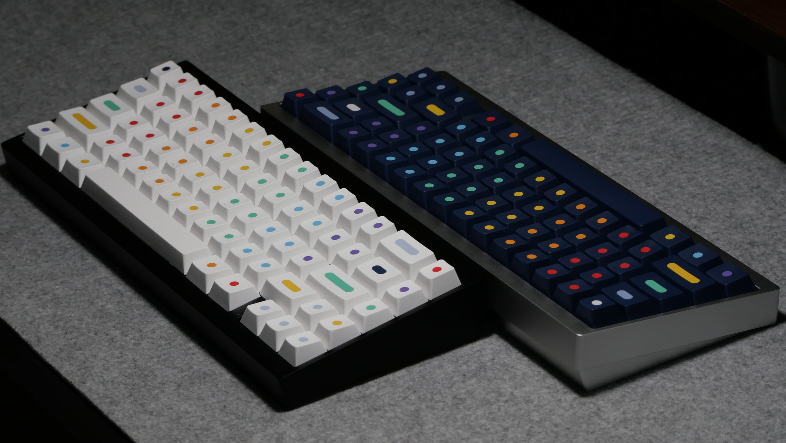

- **设计**：Biip
- **制造**：GMK
- **高度**：Cherry 原厂高度
- **材质**：ABS
- **工艺**：二色
- **兼容性**：Cherry MX 开关和 MX 类似风格
- **发售时间**：2021 年 2 月 5 日
- **相关链接**：[GB](https://geekhack.org/index.php?topic=111031.0) | [购买链接](https://www.zfrontier.com/app/mch/lqXN8wb2zN31)

又是 Biip 的作品，很有想法的一套键帽，字符让我想起 [Flow Circular](https://fonts.google.com/specimen/Flow+Circular) 字体。

### Retro100

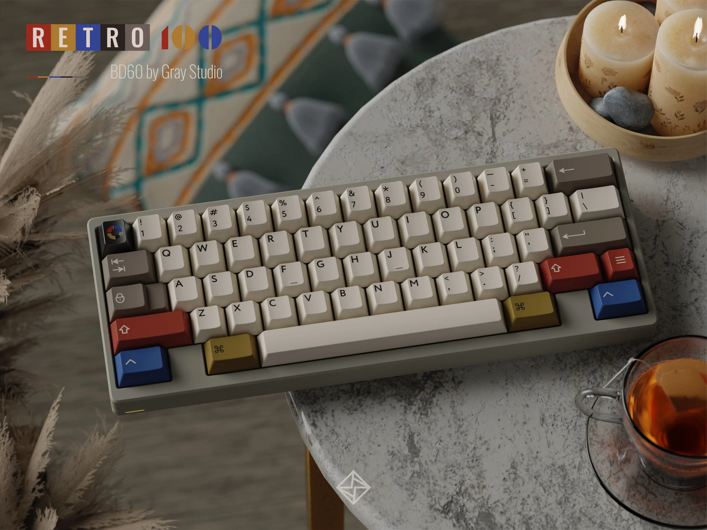

- **设计**：Mars
- **制造**：PBTfans
- **高度**：Cherry 原厂高度
- **材质**：PBT
- **工艺**：二色（四颗特殊 <kbd>R</kbd> <kbd>G</kbd> <kbd>B</kbd> <kbd>Y</kbd> 为热升华）
- **兼容性**：Cherry MX 开关和 MX 类似风格
- **发售时间**：2024 年 1 月 31 日
- **相关链接**：[发售预告](https://www.zfrontier.com/app/flow/LAOGkRM6lMAB)
- **购入时间**：2024 年 3 月 10 日
- **购入 Kit(s)**：Icon Base + Rainbow Icon + Relegendables + Spacebars
- **购入价格**：￥599 + ￥199 + ￥119 + ￥89 = ￥1,006

> 灵感来源于佳能于 1982 年自产搭载牙膏 8088cpu 的 micro computer：AS-100 基本配色来源于 AS-100 配套键盘上的键帽，点缀颜色以及图形设计来源于 AS-100 宣传海报上电脑系统的配色和 UI。
>
> —— Mars

### Poco

- **设计**：LYKKO STUDIO
- **制造**：PBTfans
- **高度**：Cherry 原厂高度
- **材质**：ABS
- **工艺**：二色
- **兼容性**：Cherry MX 开关和 MX 类似风格
- **发售时间**：2023 年 4 月 28 日
- **相关链接**：[发售预告](https://www.zfrontier.com/app/flow/ElqWxwZOX1GM)
- **购入时间**：2023 年 5 月 30 日
- **购入 Kit(s)**：Base + Alphas
- **购入价格**：￥659 + ￥179 = ￥838

> 你是否曾有过这种感觉，就是明明有很多事情等待你去完成却又什么都不想做，而只想摆烂的心情？这就是 Poco 今天的心情，也是这套键帽的设计灵感。
>
> “Poco 不想去上班，只想在家里和他的小宠物待在一起，享受当下的美好。
>
> Poco 为东京的一个大型财团效力，然而今天的他，面对起床上班这件事情陷入了前所未有的困惑。为什么我每天要起这么早，穿上令人难受的衬衫，领带，花费很长的时间通勤去办公室？为什么？为什么？为什么？”
>
> 以上就是本次的设计灵感，我们常常会像 Poco 那样面对同样的境遇，这虽然取决于我们是否热爱自己的工作，但不可否认的是大家或多或少都有过类似的感受，这可能就是人类悲欢的交织所在吧。
>
> —— LYKKO STUDIO

### Retro Dark Lights

- **设计**：Mars
- **制造**：PBTfans
- **高度**：Cherry 原厂高度
- **材质**：PBT（Extra Base Kit 为 ABS）
- **工艺**：二色
- **兼容性**：Cherry MX 开关和 MX 类似风格
- **发售时间**：2023 年 2 月 24 日
- **相关链接**：[发售预告](https://www.zfrontier.com/app/flow/LZ1A9JWY1NYl)
- **购入时间**：2023 年 5 月 30 日
- **购入 Kit(s)**：Extra Base
- **购入价格**：￥450

> 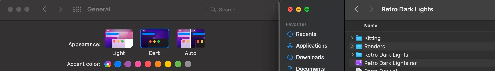
>
> 与 Retro-Lights 不同，Retro Dark Lights 的灵感来源是 Mac OS Dark 模式。
>
> 这些不同之处来自 macOS 中的窗口按钮。
>
> —— Mars

### Tyche-One

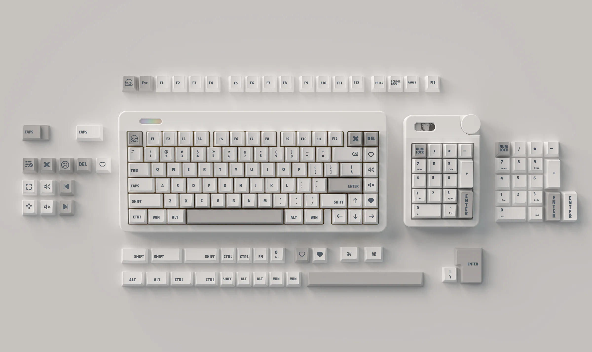

- **设计**：Chaucer
- **高度**：Cherry 原厂高度
- **材质**：PBT
- **工艺**：热升华
- **兼容性**：Cherry MX 开关和 MX 类似风格
- **发售时间**：2022 年 9 月 8 日
- **相关链接**：[GB](https://www.zfrontier.com/app/flow/9QjzmaBWBNga)

### 喵兜

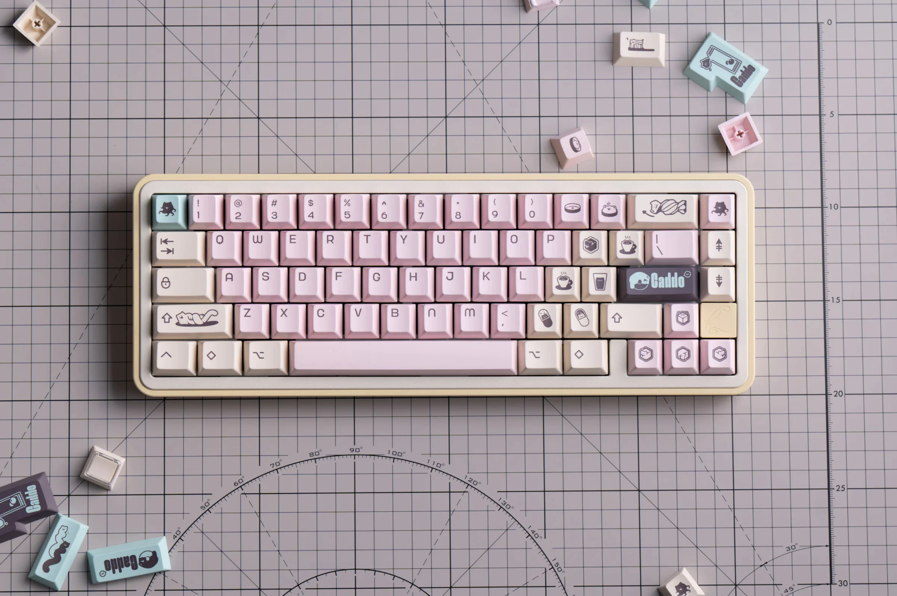

- **设计**：KeyBye Lab
- **制造**：恩溶科技
- **高度**：Cherry 原厂高度
- **材质**：PBT
- **工艺**：热升华
- **兼容性**：Cherry MX 开关和 MX 类似风格
- **发售时间**：2024 年 1 月 11 日
- **相关链接**：[GB](https://www.zfrontier.com/app/flow/J7Wan3x0vrJR)
- **购入时间**：2024 年 3 月 31 日
- **购入价格**：￥189

### 月球人

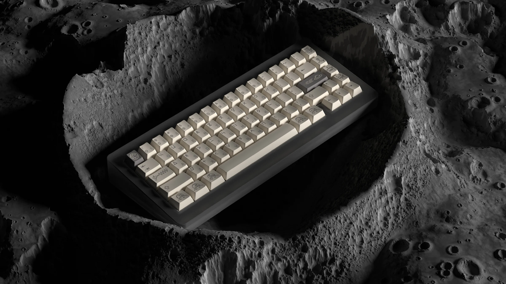

- **设计**：Mink
- **制造**：Geekark
- **高度**：Cherry 原厂高度
- **材质**：PBT
- **工艺**：热升华
- **兼容性**：Cherry MX 开关和 MX 类似风格
- **发售时间**：2021 年 5 月 15 日
- **相关链接**：[IC](https://www.zfrontier.com/app/flow/29oyOxEkKk3O)

### ЯUBBER

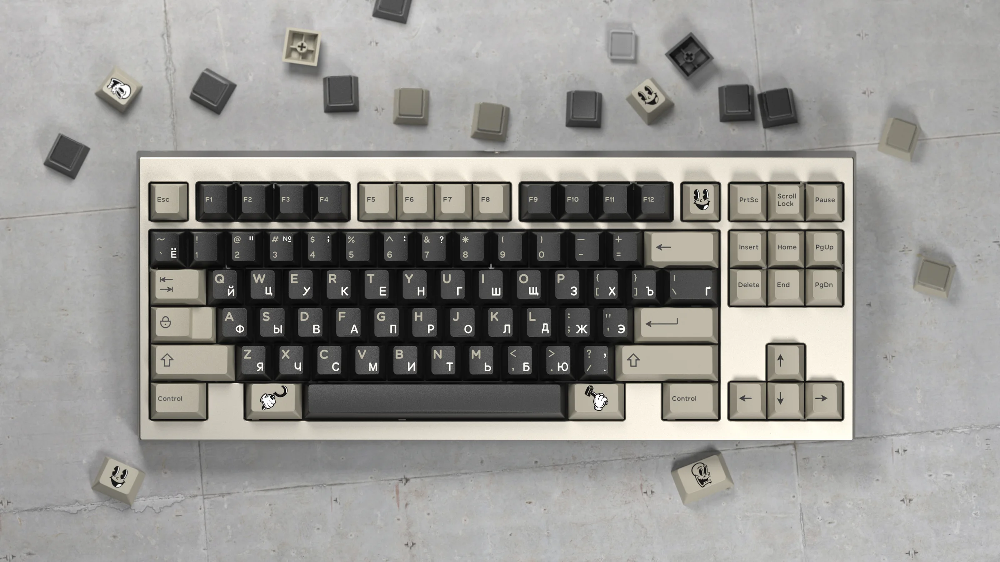

- **设计**：Manuel
- **制造**：Domikey
- **高度**：Cherry 原厂高度
- **材质**：ABS
- **工艺**：二色 / 三色
- **兼容性**：Cherry MX 开关和 MX 类似风格
- **发售时间**：2022 年 9 月 30 日
- **相关链接**：[IC](https://www.zfrontier.com/app/flow/2dbnamM9Xy9X) | [购买链接](https://www.zfrontier.com/app/mch/lGQw8zzppkkB)

> 这套键帽的设计灵感来源于前苏联创作出来的橡皮管动画风格（Rubber Hose drawing style）。
>
> —— Manuel
