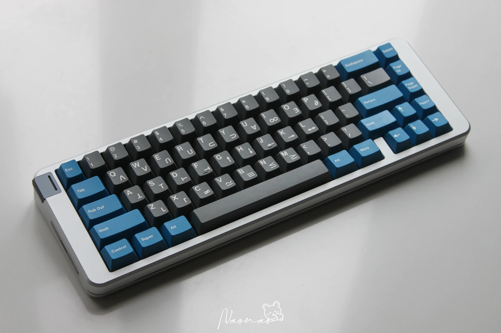
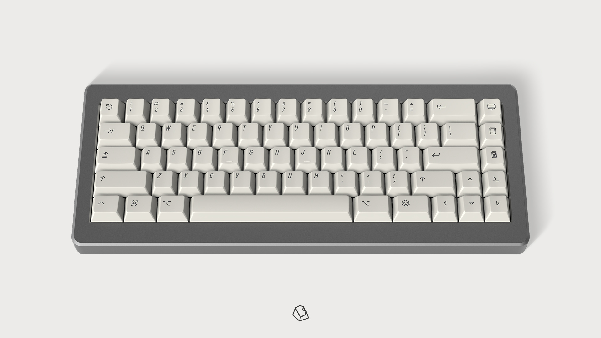

这是一个温水煮青蛙的的故事。

最开始的我只是想要一把打游戏用的机械键盘，当时对键盘的认知还停留在 Cherry、红黑茶轴等入门常见的名词上。在买了第一把 87 键配列的键盘后，又不经意刷到了一把 65% 配列的键盘，小巧精致的外观立马让我吃锅望盆，当了解到这是一个名叫 KDBfans 推出的“客制化键盘”，不经意见

## 套件

键盘主体由三部分组成：套件、轴体和键帽。套件是一把键盘最主要的组成部分，决定了键盘的颜值、结构、使用感受等等。套件最少包含外壳、PCB、定位板、连接各部分用的螺丝等内容，现在的客制化键盘还会随附键盘填充物 [^1]、装饰品 [^2]、键盘连接线、键盘收纳包等物品。

[^1]: 为了解决键盘的空腔音问题，填充物俗称声音包。
[^2]: 如铭牌等装饰件。

### Navi 70

- **设计者**：Matrix Lab
- **配列**：70%
- **发售时间**：2023 年 05 月 10 日
- **发售价格**：￥3500
- **购入时间**：2024 年 03 月 08 日
- **购入版本**：阳极银，小门牙
- **购入价格**：￥2650

心目中的 70% 配列的最佳套件。

### SONIC 170

- **设计者**：rien
- **配列**：70%
- **发售时间**：2023 年 6 月 28 日
- **发售价格**：￥1799 起
- **相关链接**：[zFrontier](https://www.zfrontier.com/app/flow/wJ9bg5ZpvMXp)

### PT990

- **设计者**：Percent Studio
- **配列**：65%
- **发售时间**：2022 年 10 月 7 日
- **发售价格**：￥2699 起
- **相关链接**：[zFrontier](https://www.zfrontier.com/app/flow/pvaxm9BgkwyO)

### Space 65

- **设计者**：Gray Studio
- **版本**：R3
- **配列**：65%
- **发售时间**：2022 年 1 月 13 号
- **发售价格**：￥2299 起
- **相关链接**：[zFrontier](https://www.zfrontier.com/app/flow/2JkkaEAxjzaM) | [YouTube](https://www.youtube.com/watch?v=XqE8re3CsGU)

### Razor 65

- **设计者**：TWP WORKS
- **配列**：65%
- **发售时间**：2023 年 2 月 28 日
- **发售价格**：￥949 起
- **相关链接**：[zFrontier](https://www.zfrontier.com/app/flow/xA3gZqmxjyyM)

### 8XV 3.0

- **设计者**：Matrix Lab
- **配列**：80%
- **发售时间**：2022 年 1 月 17 日
- **发售价格**：￥3300 起
- **相关链接**：[石墨文档](https://shimo.im/docs/WGK89JQCYrRvjqtk/read)

### Class 80

- **设计者**：M-M Studio
- **配列**：80%
- **发售时间**：2023 年 10 月 25 日
- **发售价格**：￥1950 起
- **相关链接**：[zFrontier](https://www.zfrontier.com/app/flow/VL9EObV1Mjzm)

### NCR 80

- **设计者**：九九
- **配列**：80%
- **发售时间**：2021 年 4 月 6 日
- **发售价格**：￥399 起
- **相关链接**：[zFrontier](https://www.zfrontier.com/app/flow/D7OvzYkKp7rE)
- **购入时间**：2024 年 03 月 17 日
- **购入版本**：Cherry G80-3007 的浅灰，WKL
- **购入价格**：￥399

## 键帽

### 2048

- **设计者**：Biip
- **制造商**：EnjoyPBT
- **高度**：Cherry 原厂高度
- **材质**：PBT
- **工艺**：热升华
- **兼容性**：Cherry MX 开关和 MX 类似风格
- **发售时间**：2019 年 4 月 19 日
- **相关链接**：[KeebTalk](https://www.keebtalk.com/t/gb-enjoypbt-extended-2048/5794)

> Heavily inspired by the [AEKII](https://deskthority.net/wiki/Apple_Extended_Keyboard_II), the main idea was to create an icon based keyset with a neo-retro look, inspired by old Apple keyboards. I wanted to have something with a minimalistic but intuitive look, which explains the icons mods!
>
> I took time to re-think the kits, get rid of the useless stuff and basically made it simpler.
>
> —— Biip

心目中最好看的一套键帽，刚入圈的时候就被这套键帽吸引，几年过去了，还是没有一套键帽可以取代它在我心目中的地位。

### Retro100

- **设计者**：Mars
- **制造商**：PBTfans
- **高度**：Cherry 原厂高度
- **材质**：PBT
- **工艺**：二色 + 热升华
- **兼容性**：Cherry MX 开关和 MX 类似风格
- **发售时间**：2024 年 1 月 31 日
- **相关链接**：[zFrontier](https://www.zfrontier.com/app/flow/LAOGkRM6lMAB)
- **购入时间**：2024 年 3 月 10 日
- **购入 Kit(s)**：Icon Base + Rainbow Icon + Relegendables + Spacebars
- **购入价格**：￥599 + ￥199 + ￥119 + ￥89 = ￥1,006

> 灵感来源于佳能于 1982 年自产搭载牙膏 8088cpu 的 micro computer：AS-100 基本配色来源于 AS-100 配套键盘上的键帽，点缀颜色以及图形设计来源于 AS-100 宣传海报上电脑系统的配色和 UI。
>
> —— Mars

### Poco

- **设计者**：LYKKO STUDIO
- **制造商**：PBTfans
- **高度**：Cherry 原厂高度
- **材质**：ABS
- **工艺**：二色
- **兼容性**：Cherry MX 开关和 MX 类似风格
- **发售时间**：2023 年 4 月 28 日
- **相关链接**：[zFrontier](https://www.zfrontier.com/app/flow/ElqWxwZOX1GM)
- **购入时间**：2023 年 5 月 30 日
- **购入 Kit(s)**：Base + Alphas
- **购入价格**：￥659 + ￥179 = ￥838

> 你是否曾有过这种感觉，就是明明有很多事情等待你去完成却又什么都不想做，而只想摆烂的心情？这就是 Poco 今天的心情，也是这套键帽的设计灵感。
>
> “Poco 不想去上班，只想在家里和他的小宠物待在一起，享受当下的美好。
>
> Poco 为东京的一个大型财团效力，然而今天的他，面对起床上班这件事情陷入了前所未有的困惑。为什么我每天要起这么早，穿上令人难受的衬衫，领带，花费很长的时间通勤去办公室？为什么？为什么？为什么？”
>
> 以上就是本次的设计灵感，我们常常会像 Poco 那样面对同样的境遇，这虽然取决于我们是否热爱自己的工作，但不可否认的是大家或多或少都有过类似的感受，这可能就是人类悲欢的交织所在吧。
>
> —— LYKKO STUDIO

### Retro Dark Lights

- **设计者**：Mars
- **制造商**：PBTfans
- **高度**：Cherry 原厂高度
- **材质**：PBT（Extra Base Kit 为 ABS）
- **工艺**：二色
- **兼容性**：Cherry MX 开关和 MX 类似风格
- **发售时间**：2023 年 2 月 24 日
- **相关链接**：[zFrontier](https://www.zfrontier.com/app/flow/LZ1A9JWY1NYl)
- **购入时间**：2023 年 5 月 30 日
- **购入 Kit(s)**：Extra Base
- **购入价格**：￥450

> 
>
> 与 Retro-Lights 不同，Retro Dark Lights 的灵感来源是 Mac OS Dark 模式。
>
> 这些不同之处来自 macOS 中的窗口按钮。
>
> —— Mars

## 轴体

## 行话 & 黑话

### 通用

#### IC

Interest Check 兴趣度调查，是产品正式发售前的一个阶段，具体为发布一些产品相关的信息看看大家对其的兴趣度，顺便也会收集一些改进建议，以便在产品正式发售前对其进行调整。

#### GB

Group Buy 团购，是客制化键盘的发售阶段，因为很多客制化键盘都是小工作室设计出来的，没有资金去造大量的键盘，所以会选择团购集资造键盘的方式。

#### QC

#### R1, R2, R3…

Revision 1, Revision 2, Revision 3…

### 套件

#### 配列 / WK / WKL / HHKB / 大门牙 / 小门牙 / 无门牙 / TKL

#### 焊接 / 热插拔

### 键帽

#### R1, R2, R3…

没有找到官方的解释，猜测可能是 Row 1, Row 2, Row 3…

带人体工程学的一套键帽，每排键帽的高度是不相同的（XDA、DSA 类平胸键帽除外）。

每排的高度从矮到高分为 R1-R4 4 个高度（极个别也有 R5 高度如 RACE2）：

- R1：R1 高度指 <kbd>Ctrl</kbd>、<kbd>Win</kbd>、<kbd>Space</kbd> 这一排 以及 Shift Z-? 这一排键帽的高度
- R2：R2 高度指 A- ‘ 这一键帽的高度
- R3：R3 高度指 Q-】这一排键帽的高度
- R4：R4 高度指 ~- 数字 和 Esc - F 区这一排键帽的高度

每一排键帽的高度以及键帽表面倾斜度、倾斜方向都不相同，这样的设计使得使用者在打字过程中双手会更加舒适。

除了一套键帽的高度不一样外，不同类型的键帽高度也不一样，常见的键帽类型及其高度如下：

1. 原厂高度，原厂指的是 Cherry。原厂高度键帽是指键帽高度和 Cherry 所惯用的键帽一致。
1. OEM 高度，OEM 是代工厂商的缩写。意思就是非原厂生产 在机械键盘键帽领域，指比原厂（产地德国）生产的键帽高一层的代工厂商键帽。
1. SA 高球帽，首先这里要分清球帽与普通键帽的区别；其次，高球就是高度较高的球帽，也有 R1-R4 四种不同高度。
1. DSA 矮球帽，顾名思义，就是高度较矮的球帽（俗称平胸），但不同的是 DSA 整体是没有高度区别的。

#### Kit / 大全套 / 小全套 / 个性

## 相关链接

- [键帽高度 - GT WiKi](https://wiki.glab.online/knowledge/keycapheight/)
