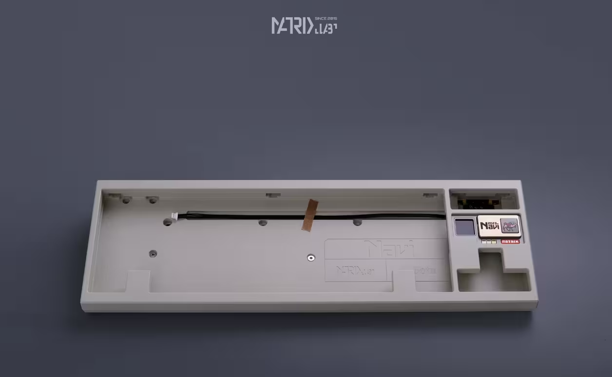
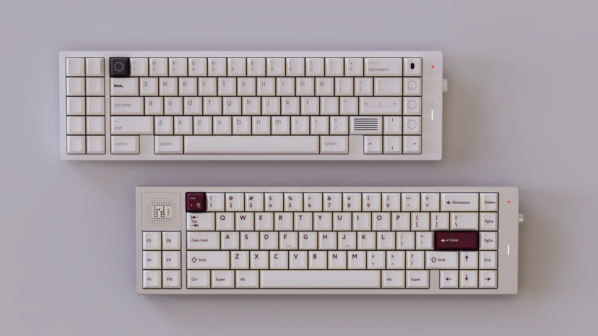
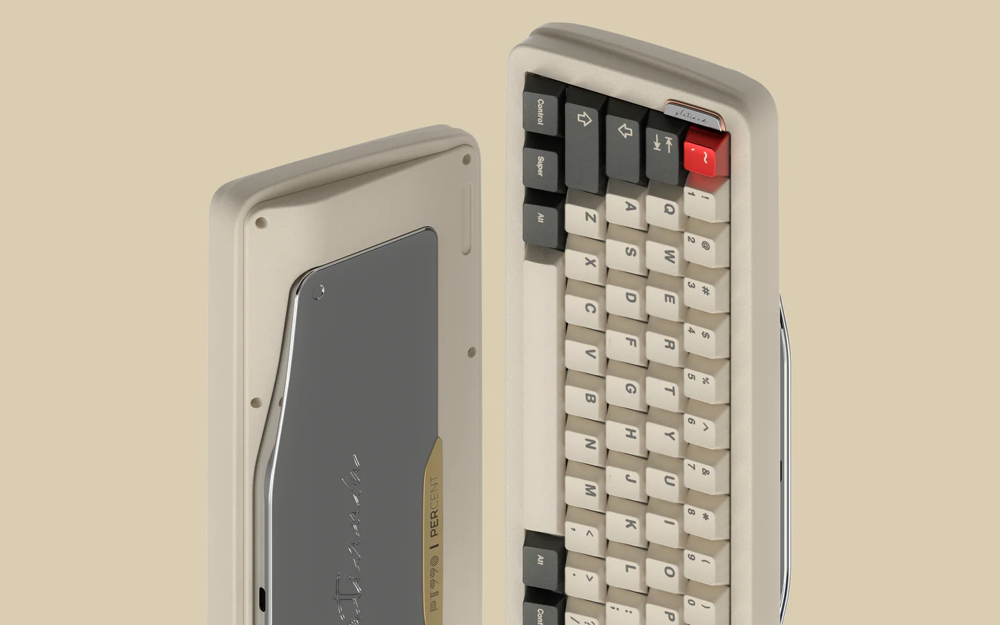
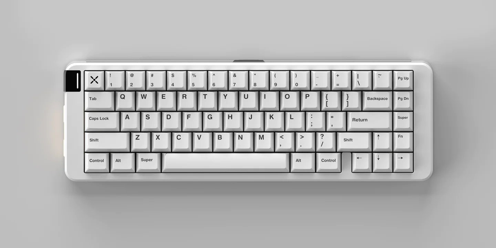
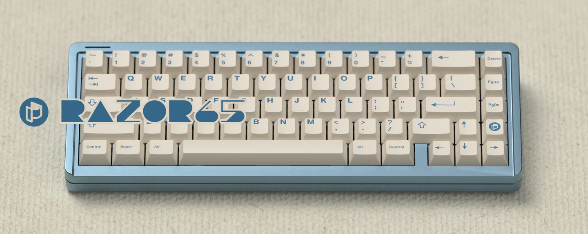
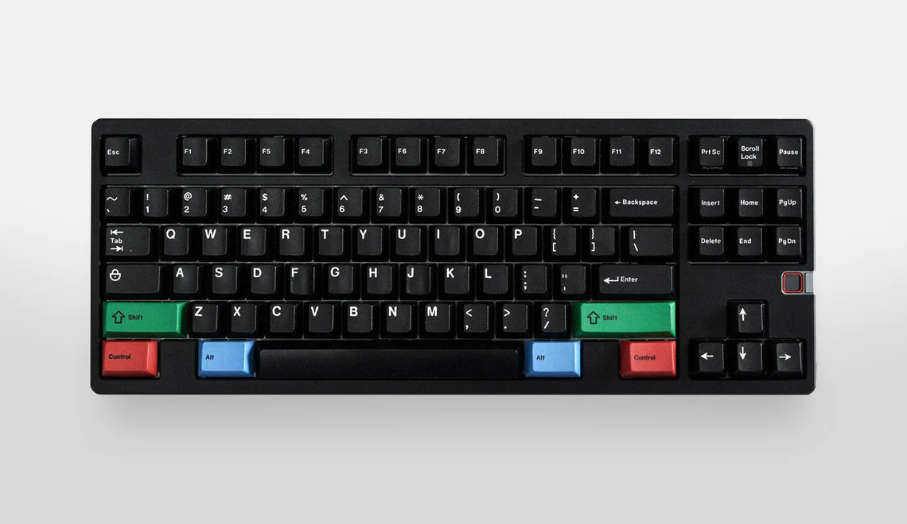

烧钱又迷人。

## Most wanted

| 型号       | Revision | 配列  | 设计者            | 发售价     | 图片                                      | 相关链接                                                  |
| -------- | -------- | --- | -------------- | ------- | --------------------------------------- | ----------------------------------------------------- |
| Navi70   | -        | 70% | Matrix Lab     | ￥3500   |  | -                                                     |
| SONIC170 | -        | 70% | rien           | ￥1799 起 |  | [GB](https://www.zfrontier.com/app/flow/wJ9bg5ZpvMXp) |
| PT990    | -        | 65% | Percent Studio | ￥2699 起 |  | [IC](https://www.zfrontier.com/app/flow/pvaxm9BgkwyO) |
| Space65  | R3       | 65% | Gray Studio    | ￥2299 起 |  | [GB](https://www.zfrontier.com/app/flow/2JkkaEAxjzaM) |
| Razor65  | -        | 65% | TWP WORKS      | ￥949 起  |  | [GB](https://www.zfrontier.com/app/flow/xA3gZqmxjyyM) |
| 8XV 3.0  | -        | 80% | Matrix Lab     | ￥3300 起 |  | [GB](https://shimo.im/docs/WGK89JQCYrRvjqtk/read)     |
