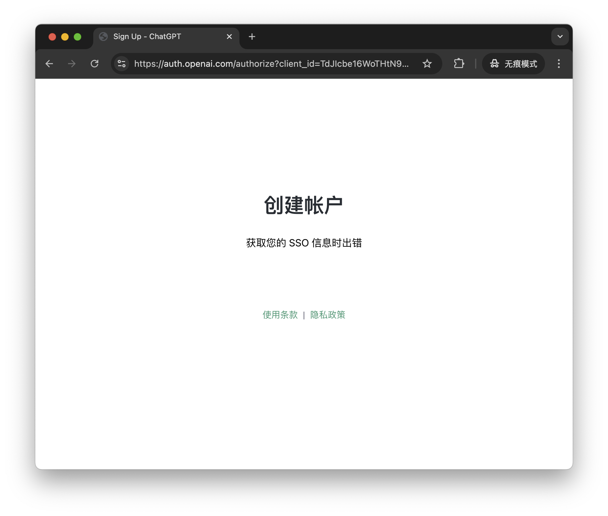

在登录或注册 OpenAI 账号时，发生错误：

猜测错误的原因是客户端的时间对不上你所在时区的时间，比如你在中国通过美国的代理进行访问，客户端时间（美国时间）与你所在时区的时间（中国时间）就会对不上。如果你通过香港的代理进行访问，虽然时间对的上，但是还是会出现这个问题，猜测是因为目前香港不属于 OpenAI [支持的国家和地区](https://platform.openai.com/docs/supported-countries)。将代理切换为台湾的后问题消失。

但是这个问题并没有到此结束，在我的环境中测试发现，只有使用 Chrome 时存在这个问题，使用 Safari 和 macOS 桌面客户端时都没有这个问题，并且只有新注册的账号存在这个问题，老账号则没有这个问题，这就很匪夷所思了。

在 [官方论坛](https://community.openai.com/t/cant-fix-this-error-welcome-back-something-went-wrong-while-getting-your-sso-info/934573/4) 中有人提出了一种解决方案：将 URL 的域名部分从 `auth.openai.com` 变更为 `auth0.openai.com`，然后加载新的地址，这时候应该就可以正常登录或注册了。我还没有测试过是否可行，但愿是一个靠谱的方案。
